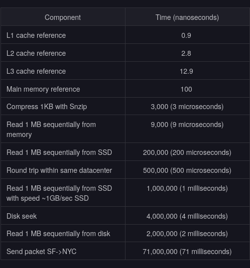
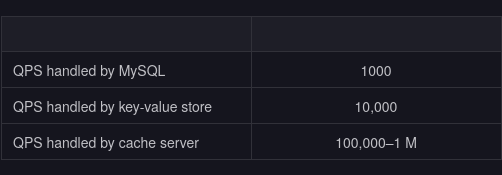

# Put Back-of-the-envelope Numbers in Perspective

- Why do we use back-of-the-envelope calculations?

  - A distributed system has compute nodes connected via a network. There’s a wide variety of available compute nodes and they can be connected in many different ways. Back-of-the-envelope calculations help us ignore the nitty-gritty details of the system (at least at the design level) and focus on more important aspects.

- Some examples of a back-of-the-envelope calculation could be:
  - The number of concurrent TCP connections a server can support.
  - The number of requests per second (RPS) a web, database, or cache server can handle.
  - The storage requirements of a service.

- Choosing an unreasonable number for such calculations can lead to a flawed design. Since we need good estimations in many design problems, we’ll discuss all the relevant concepts in detail in this lesson. These concepts include:
  - The types of data center servers.
  - The realistic access latencies of different components.
  - The estimation of RPS that a server can handle.
  - Examples of bandwidth, servers, and storage estimation.

[[1742519910-EGEX|Center servers]]

- Standard numbers to remember
  - A lot of effort goes into the planning and implementation of a service. But without any basic knowledge of the kind of workloads machines can handle, this planning isn’t possible. Latencies play an important role in deciding the amount of workload a machine can handle. The table below depicts some of the important numbers system designers should know in order to perform resource estimation.

    

  - Apart from the latencies listed above, there are also throughput numbers measured as queries per second (QPS) that a typical single-server datastore can handle.

    

  - The numbers above are approximations and vary greatly depending on a number of reasons like the type of query (point and range), the specification of the machine, the design of the database, the indexing, and so on.

- Requests estimation
  - This section discusses the number of requests a typical server can handle in a second. Within a server, there are limited resources and depending on the type of client requests, different resources can become a bottleneck. Let’s understand two types of requests.
    - CPU-bound requests: These are the type of requests where the limiting factor is the CPU.
    - Memory-bound requests: These are the types of requests that are limited by the amount of memory a machine has.

- Let’s approximate the RPS for each type of request. But before that, we need to assume the following:
  - Our server has the specifications of the typical server that we defined in the table above.
  - Operating systems and other auxiliary processes have consumed a total of 16 GB of RAM.
  - Each worker consumes 300 MBs of RAM storage to complete a request.
  - For simplicity, we assume that the CPU obtains data from the RAM. Therefore, a caching system ensures that all the required content is available for serving, without there being a need to access the storage layer.
  - Each CPU-bound request takes 200 milliseconds, whereas a memory-bpkgs.vimPlugins.nvim-treesitter.withAllGrammarsound request takes 50 milliseconds to complete.

- Let’s do the computation for each type of request.
  - CPU bound: A simple formula used to calculate the RPS for CPU-bound requests is:
    $$RPS_{CPU} = Num_{CPU} \times \dfrac{1}{Task_{time}}$$

  - In this calculation, we use these terms:
    - $\small RPS_{CPU}$: CPU bound RPS
    - $Num_{CPU}$: Number of CPU threads, which are also called hardware threads
    - $Task_{time}$: The time each task takes to complete

    $$RPS_{CPU} = 72 \times \dfrac{1}{200ms} = 360 RPS$$

  - The rationale for the calculation shown above is that we can visualize one second as a box and we calculate how many mini-boxes (tasks) can fit inside the big box—that is, the number of tasks that can be completed in one second by a number of CPUs. So, a higher number of CPUs/threads will result in a higher RPS.

  - Memory-bound requests: For memory-bound requests, we use the following formula:
    $$RPS_{memory} = \dfrac{RAM_{size}}{Worker_{memory}} \times \dfrac{1}{Task_{time}}$$
  - In this calculation, we use these terms:

    - $RPS_{memory}$: Memory bound RPS
    - $RAM_{size}$: Total size of RAM
    - $Woker_{memory}$: A worker in memory that manages a request

    $$RPS_{memory} = \dfrac{240GB}{300MB} \times \dfrac{1}{50ms} = 16,000 RPS$$

  - Continuing our box analogy from the explanation of CPU-bound processes, here we first calculate the number of boxes there are (how many memory-bound processes a server can host) and then how many mini-boxes (tasks) we can fit in each of the bigger boxes.
  - A service receives both the CPU-bound and memory-bound requests. Considering the case that half the requests are CPU-bound and the other half memory-bound, we can handle a total of
  $$\dfrac{360}{2} + \dfrac{16000}{2} = 8180 \approx 8000$$

  - The calculations above are only an approximation for developing an understanding of the basic factors involved in estimating RPS. In reality, a lot of other factors come into play. For instance, latency is required to do a disk seek in case the data is not readily available in RAM or if a request is made to the database server, which will also include the database and network latency. Additionally, the type of query also matters. Of course, faults, bugs in code, node failures, power outages, network disruptions, and more are inevitable factors.
  - On a typical day, various types of requests arrive, and a powerful server that only serves static content from the RAM might handle as many as 500k RPS. On the other end of the spectrum, computational-intensive tasks like image processing may only allow a maximum of 50 RPS.
  - Note: In reality, capacity estimation is a hard problem, and organizations learn how to improve it over the years. A monitoring system keeps an eye on all parts of our infrastructure to give us early warnings about overloading servers.
