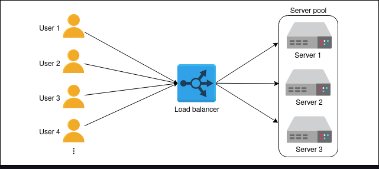
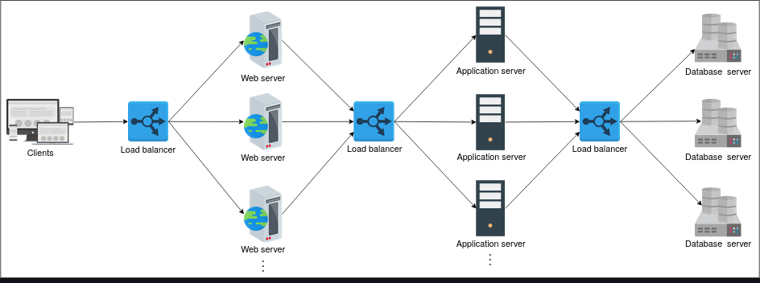

# load balancers

## What is load balancing?

- Millions of requests could arrive per second in a typical data center. To serve these requests, thousands (or a hundred thousand) servers work together to share the load of incoming requests.
- A load balancer (LB) is the answer to the question. The job of the load balancer is to fairly divide all clients’ requests among the pool of available servers. Load balancers perform this job to avoid overloading or crashing servers.

- The load balancing layer is the first point of contact within a data center after the firewall. A load balancer may not be required if a service entertains a few hundred or even a few thousand requests per second. However, for increasing client requests, load balancers provide the following capabilities:
  - [[1741923847-NFDA|Scalability]]: By adding servers, the capacity of the application/service can be increased seamlessly. Load balancers make such upscaling or downscaling transparent to the end users.
  - [[1741861084-LOMS|Availability]]: Even if some servers go down or suffer a fault, the system still remains available. One of the jobs of the load balancers is to hide faults and failures of servers.
  - Performance: Load balancers can forward requests to servers with a lesser load so the user can get a quicker response time. This not only improves performance but also improves resource utilization.
  

## Placing load balancers

Generally, LBs sit between clients and servers. Requests go through to servers and back to clients via the load balancing layer. However, that isn’t the only point where load balancers are used.
Let’s consider the three well-known groups of servers. That is the web, the application, and the database servers. To divide the traffic load among the available servers, load balancers can be used between the server instances of these three services in the following way:
    - Place LBs between end users of the application and web servers/application gateway.
    - Place LBs between the web servers and application servers that run the business/application logic.
    - Place LBs between the application servers and database servers.

In reality, load balancers can be potentially used between any two services with multiple instances within the design of a system.

## Services offered by load balancers

- LBs not only enable services to be scalable, available, and highly performant, they offer some key services like the following:
  - Health checking: LBs use the heartbeat protocol to monitor the health and, therefore, reliability of end-servers. Another advantage of health checking is the improved user experience.
  - TLS termination: LBs reduce the burden on end-servers by handling TLS termination with the client.
  - Predictive analytics: LBs can predict traffic patterns through analytics performed over traffic passing through them or using statistics of traffic obtained over time.
  - Reduced human intervention: Because of LB automation, reduced system administration efforts are required in handling failures.
  - Service discovery: An advantage of LBs is that the clients’ requests are forwarded to appropriate hosting servers by inquiring about the service registry.
  - Security: LBs may also improve security by mitigating attacks like denial-of-service (DoS) at different layers of the OSI model (layers 3, 4, and 7).

As a whole, load balancers provide flexibility, reliability, redundancy, and efficiency to the overall design of the system.

## Global and Local Load Balancing

- From the previous lesson, it may seem like load balancing is performed only within the data center. However, load balancing is required at a global and a local scale. Let’s understand the function of each of the two:
  - [[1743605667-TMSV|Global server load balancing (GSLB)]]: GSLB involves the distribution of traffic load across multiple geographical regions.
  - Local load balancing: This refers to load balancing achieved within a data center. This type of load balancing focuses on improving efficiency and better resource utilization of the hosting servers in a data center.

## [[1743606544-WYDL|Advanced Details of Load Balancers]]
