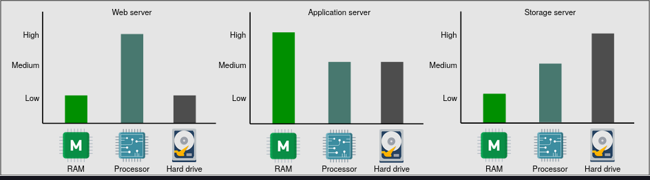

# Center servers

- Types of data center servers
  - Data centers don’t have a single type of server. Enterprise solutions use commodity hardware to save cost and develop scalable solutions. Below, we discuss the types of servers that are commonly used within a data center to handle different workloads.
      

  - Web servers
    - For scalability, the web servers are decoupled from the application servers. Web servers are the first point of contact after [[1742476425-WNDB|load balancers]]. Data centers have racks full of web servers that usually handle API calls from the clients. Depending on the service that’s offered, the memory and storage resources in web servers can be small to medium. However, such servers require good computational resources. For example, Facebook has used a web server with 32 GB of RAM and 500 GB of storage space. But for its high-end computational needs, it partnered with Intel to build a custom 16-core processor.

  - Application servers
    - Application servers run the core application software and business logic. The difference between web servers and application servers is somewhat fuzzy. Application servers primarily provide dynamic content, whereas web servers mostly serve static content to the client, which is mostly a web browser. They can require extensive computational and storage resources. Storage resources can be volatile and non-volatile. Facebook has used application servers with a RAM of up to 256 GB and two types of storage—traditional rotating disks and flash—with a capacity of up to 6.5 TB.

  - Storage servers
    - With the explosive growth of Internet users, the amount of data stored by giant services has multiplied. Additionally, various types of data are now being stored in different storage units. For instance, YouTube uses the following datastores:
      - Blob storage for its encoded videos.
      - A temporary processing queue storage that can hold a few hundred hours of video content uploaded daily to YouTube for processing.
      - Specialized storage called Bigtable for storing a large number of thumbnails of videos.
      - Relational database management system (RDBMS) for users and videos metadata (comments, likes, user channels, and so on.

    - Other data stores are still used for analytics—for example, Hadoop’s HDFS. Storage servers mainly include structured (for example, SQL) and non-structured (NoSQL) data management systems.
    - Coming back to the example of Facebook, we know that they’ve used servers with a storage capacity of up to 120 TB. With the number of servers in use, Facebook is able to house exabytes of storage. One exabyte is 10181018 Bytes. By convention, we measure storage and network bandwidth in base 10, and not base 2. However, the RAM of these servers is only 32 GB.

    - Note: The servers described above are not the only types of servers in a data center. Organizations also require servers for services like configuration, monitoring, load balancing, analytics, accounting, caching, and so on.
