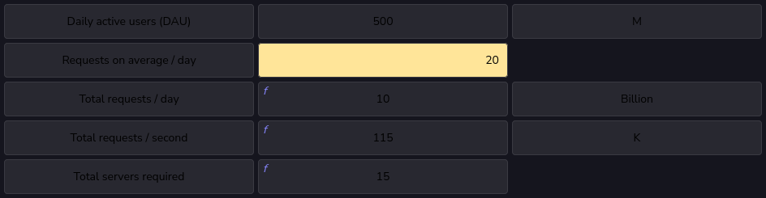

# Number of servers required

- Let’s make the following assumptions about a Twitter-like service.
  - Assumptions:
    - There are 500 million (M) daily active users (DAU).
    - A single user makes 20 requests per day on average.
    - Recall that a single server can handle 8,000 RPS.

      

  - Therefore, we approximate the number of servers by depicting how many clients a server handles on a given day:
    $$RPS_{memory} = \dfrac{\text {Number of daily active users}}{\text {RPS of a server}}$$

  - In this case, it’s equal to:
    $$\dfrac{\text {500M}}{\text {8000}} = 62,500$$

    
