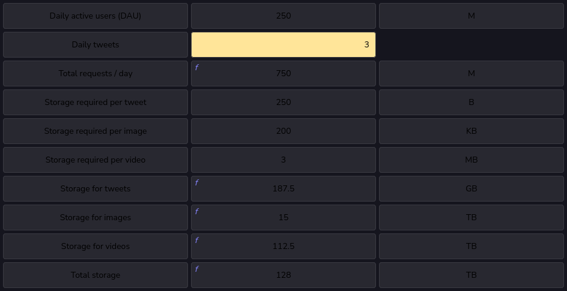
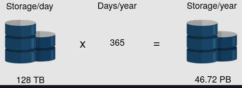

# Storage requirements

- In this section, we attempt to understand how **storage estimation** is done by using Twitter as an example. We estimate the amount of storage space required by Twitter for new tweets in a year. Let’s make the following assumptions to begin with:
  - We have a total of 250 M daily active users.
  - Each user posts three tweets in a day.
  - Ten percent of the tweets contain images, whereas five percent of the tweets contain a video. Any tweet containing a video will not contain an image and vice versa.
  - Assume that an image is 200 KB and a video is 3 MB in size on average.
  - The tweet text and its metadata require a total of 250 Bytes of storage in the database.
- Then, the following storage space will be required:
    

  - Total storage required for one day =  0.1875TB+15TB+112.5TB≈128TB0.1875TB+15TB+112.5TB≈128TB
  - Storage required for one year = 365×128TB=46.72PB365×128TB=46.72PB
  
