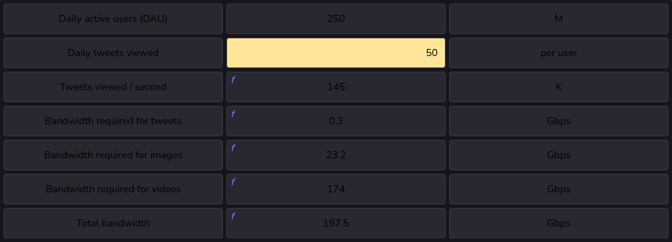

# Bandwidth requirements

- In order to estimate the bandwidth requirements for a service, we use the following steps:
  - Estimate the daily amount of incoming data to the service.
  - Estimate the daily amount of outgoing data from the service.
  - Estimate the bandwidth in Gbps (gigabits per second) by dividing the incoming and outgoing data by the number of seconds in a day.

- **Incoming traffic**: Let’s continue from our previous example of Twitter, which requires 128 TBs of storage each day. Therefore, the incoming traffic should support the following bandwidth per second:
    $$\dfrac{128 \times 10^{12}}{24 \times 60 \times 60} \times 8 \approx 12Gbps }$$

  - Note: We multiply by 8 in order to convert Bytes into bits because bandwidth is measured in bits per second.

- **Outgoing traffic**: Assume that a single user views 50 tweets in a day. Considering the same ratio of five percent and 10 percent for videos and images, respectively, for the 50 tweets, 2.5 tweets will contain video content whereas five tweets will contain an image. Considering that there are 250 M active daily users, we come to the following estimations:

- Twitter will need a total of 12 Gbps12 Gbps of incoming traffic and 197.5 Gbps197.5 Gbps of outgoing, assuming that the uploaded content is not compressed. Total bandwidth requirements = 12+197.5=209.5 Gbps12+197.5=209.5 Gbps.

