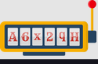
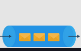
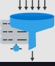
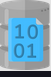
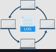
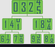

# Introduction to Building Blocks for Modern System Design

- The bottom-up approach for modern system design
  - System design problems usually have some similarities, though specific details are often unique. We have extracted these similarities across design problems as the basic building blocks we’ll be covering. One example of a building block is a load-balancing component, which we’ll probably use in every design problem in one way or the other.
  - The purpose of separating the building blocks is to thoroughly discuss their design just once. This means that later we can use them anywhere without having to go over them in detail again. We can think about building blocks as bricks to construct more effective, capable systems.
  - Many of the building blocks we discuss are also available for actual use in the public clouds, such as Amazon Web Services (AWS), Azure, and Google Cloud Platform (GCP). We can use such constructs to build a system to further cement our understanding. (We won’t construct the system in this course, but we’ve left it as an exercise for interested learners.)

- We’ll discuss the following building blocks in detail:
  - Domain Name System: This building block focuses on how to design hierarchical and distributed naming systems for computers connected to the Internet via different Internet protocols.
  

  - Load Balancers: Here, we’ll understand the design of a load balancer, which is used to fairly distribute incoming clients’ requests among a pool of available servers. It also reduces load and can bypass failed servers.
  

  - Databases: This building block enables us to store, retrieve, modify, and delete data in connection with different data-processing procedures. Here, we’ll discuss database types, replication, partitioning, and analysis of distributed databases.
  

  - Key-Value Store: It is a non-relational database that stores data in the form of a key-value pair. Here, we’ll explain the design of a key-value store along with important concepts such as achieving scalability, durability, and configurability.
  

  - Content Delivery Network: In this chapter, we’ll design a content delivery network (CDN) that’s used to keep viral content such as videos, images, audio, and webpages. It efficiently delivers content to end users while reducing latency and burden on the data centers.
  

  - Sequencer: In this building block, we’ll focus on the design of a unique IDs generator with a major focus on maintaining causality. It also explains three different methods for generating unique IDs.
  

  - Service Monitoring: Monitoring systems are critical in distributed systems because they help analyze the system and alert the stakeholders if a problem occurs. Monitoring is often useful to get early warning systems so that system administrators can act ahead of an impending problem becoming a huge issue. Here, we’ll build two monitoring systems, one for the server-side and the other for client-side errors.
  

  - Distributed Caching: In this building block, we’ll design a distributed caching system where multiple cache servers coordinate to store frequently accessed data.
  

  - Distributed Messaging Queue: In this building block, we’ll focus on the design of a queue consisting of multiple servers, which is used between interacting entities called producers and consumers. It helps decouple producers and consumers, results in independent scalability, and enhances reliability.
  

  - Publish-Subscribe System: In this building block, we’ll focus on the design of an asynchronous service-to-service communication method called a pub-sub system. It is popular in serverless, microservices architectures and data processing systems.
  

  - Rate Limiter: Here, we’ll design a system that throttles incoming requests for a service based on the predefined limit. It is generally used as a defensive layer for services to avoid their excessive usage-whether intended or unintended.
  

  - Blob Store: This building block focuses on a storage solution for unstructured data—for example, multimedia files and binary executables.
  

  - Distributed Search: A search system takes a query from a user and returns relevant content in a few seconds or less. This building block focuses on the three integral components: crawl, index, and search.
  

  - Distributed Logging: Logging is an I/O intensive operation that is time-consuming and slow. Here, we’ll design a system that allows services in a distributed system to log their events efficiently. The system will be made scalable and reliable.
  

  - Distributed Task Scheduling: We’ll design a distributed task scheduler system that mediates between tasks and resources. It intelligently allocates resources to tasks to meet task-level and system-level goals. It’s often used to offload background processing to be completed asynchronously.
  

  - Sharded Counters: This building block demonstrates an efficient distributed counting system to deal with millions of concurrent read/write requests, such as likes on a celebrity’s tweet.
  
