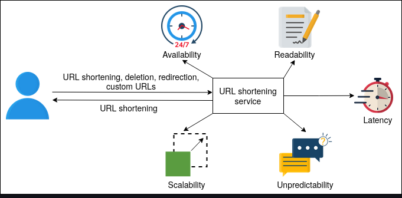
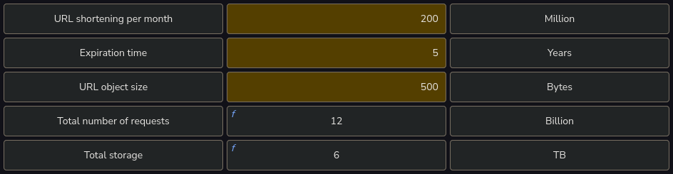
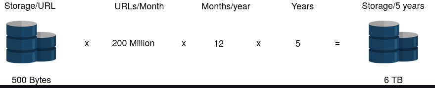
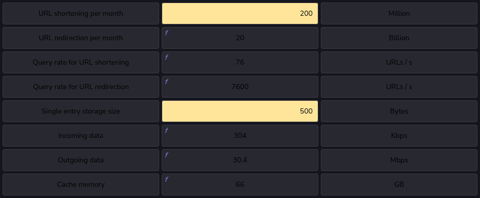
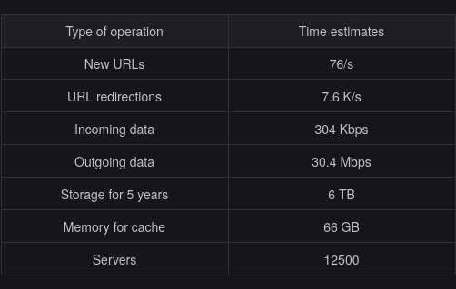
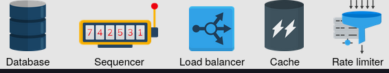

# Requirements

## Requirements for URL Shortening Design

  Let’s look at the functional and non-functional requirements for the service we’ll be designing:

- Functional requirements
  - Short URL generation: Our service should be able to generate a unique shorter alias of the given URL.
  - Redirection: Given a short link, our system should be able to redirect the user to the original URL.
  - Custom short links: Users should be able to generate custom short links for their URLs using our system.
  - Deletion: Users should be able to delete a short link generated by our system, given the rights.
  - Update: Users should be able to update the long URL associated with the short link, given the proper rights.
  - Expiry time: There must be a default expiration time for the short links, but users should be able to set the expiration time based on their requirements.

- Non-functional requirements
  - Availability: Our system should be highly available, because even a fraction of the second downtime would result in URL redirection failures. Since our system’s domain is in URLs, we don’t have the leverage of downtime, and our design must have fault-tolerance conditions instilled in it.
  - Scalability: Our system should be horizontally scalable with increasing demand.
  - Readability: The short links generated by our system should be easily readable, distinguishable, and typeable.
  - Latency: The system should perform at low latency to provide the user with a smooth experience.
  - Unpredictability: From a security standpoint, the short links generated by our system should be highly unpredictable. This ensures that the next-in-line short URL is not serially produced, eliminating the possibility of someone guessing all the short URLs that our system has ever produced or will produce.
    

## Resource estimation

- It’s better to have realistic estimations at the start. For instance, we might need to change them in the future based on the design modifications. Let’s make some assumptions to complete our estimation.
- Assumptions
  - We assume that the shortening:redirection request ratio is 1:100.
  - There are 200 million new URL shortening requests per month.
  - A URL shortening entry requires 500 Bytes of database storage.
  - Each entry will have a maximum of five years of expiry time, unless explicitly deleted.
  - There are 100 million Daily Active Users (DAU).

- Storage estimation
  - Since entries are saved for a time period of 5 years and there are a total of 200 million entries per month, the total entries will be approximately 12 billion.

    $$\text{200 Million/month} \times \text{12 months/year} \times \text{5 years}=\text{12 Billion URL shortening requests}$$
Since each entry is 500 Bytes, the total storage estimate would be 6 TB:
    $$\text{12 Billion} \times \text{500 Bytes}= \text{6 TB}$$

    
    

## Query rate estimation

- Based on the estimations above, we can expect 20 billion redirection requests per month.
  $$ \text{200 Million} \times 100=\text{20 Billion} $$
- We can extend our calculations for Queries Per Second (QPS) for our system from this baseline. The number of seconds in one month, given the average number of days per month is $ 365/12 = 30.42$:

  $$ \text{30.42 days} \times \text{24 hours} \times \text{60 minutes} \times \text{60 seconds}= \text{2628288 seconds}$$

- Considering the calculation above, new URL shortening requests per second will be:

  $$\dfrac{\text{200 Million}}{\text{2628288 seconds}}=\text{76 URLs/s}$$

- With a 1:100 shortening to redirecting ratio, the URL redirection rate per second will be:

  $$100\times76 URLs/s=7.6 K URLs/s$$

## Bandwidth estimation

- Shortening requests: The expected arrival rate will be 76 new URLs per second. The total incoming data would be 304 Kbpsper second:

  $$76 \times 500 Bytes \times 8 bits=304 Kbps$$

- Redirection requests: Since the expected rate would be 20K URLs redirections per second, the total outgoing data would be 30.4Mbps per second:
  $$\text{7.6 K} \times \text{500 Bytes} \times \text{8 bits} =\text{30.4 Mbps}$$

## Memory estimation

- We need memory estimates in case we want to cache some of the frequently accessed URL redirection requests. Let’s assume a split of 80-20 in the incoming requests. 20 percent of redirection requests generate 80 percent of the traffic.
- Since the redirection requests per second are 7.6 K, the total would be 0.66 billion for one day.
  $$ \text{7.6 K} \times \text{3600 seconds} \times \text{24 hours}=\text{0.66 billion}$$
- Since we would only consider caching 20 percent of these per-day redirection requests, the total memory requirements estimate would be 66 GB.
  $$\text{0.2} \times \text{0.66 Billion} \times \text{500 Bytes}= \text{66 GB}$$
  

  ## Number of servers estimation

  We adopt the same approximation discussed in the [[1742473546-XOTH|back-of-the-envelope]] calculations to calculate the number of servers needed: the number of daily active users and the daily user handling limit of a server are the two main factors in depicting the total number of servers required. According to the approximation, we need to divide the Daily Active Users (DAU) by 8000 to calculate the approximated number of servers.
  $$\text{Number of servers}= \dfrac{DAU}{8000} = \dfrac{100M}{8000}= \text{12500 servers}$$

## Summarizing estimation

 Based on the assumption above, the following table summarizes our estimations:

## Building blocks we will use

- With the estimations done, we can identify the key building blocks in our design. Such a list is given below:
  

  - Database(s) will be needed to store the mapping of long URLs and the corresponding short URLs.
  - Sequencer will provide unique IDs that will serve as a starting point for each short URL generation.
  - Load balancers at various layers will ensure smooth requests distribution among available servers.
  - Caches will be utilized to store the most frequent short URLs related requests.
  - Rate limiters will be used to avoid system exploitation.

- Besides these building blocks, we'll also need the following additional components to achieve the desired service:
  - Servers to handle and navigate the service requests along with running the application logic.
  - A Base-58 encoder to transform the sequencer’s numeric output to a more readable and usable alphanumeric form.
  
