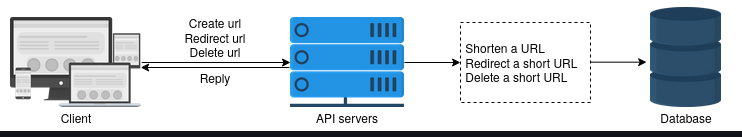
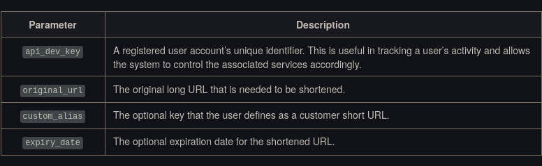

# Design and Deployment

## System APIs

- To expose the functionality of our service, we can use REST APIs for the following features:
  - Shortening a URL
  - Redirecting a short URL
  - Deleting a short URL
  

  ### Shortening a URL

  We can create new short URLs with the following definition:

  ```go
  func shortURL(api_dev_key string, original_url string, custom_alias string, expiry_date string) (string, error)
  ```

  The API call above has the following parameters:

  A successful insertion returns the user the shortened URL. Otherwise, the system returns an appropriate error code to the user.

  ### Redirecting a short URL

  To redirect a short URL, the REST API’s definition will be:

  ```go
  func redirectURL(api_dev_key string, url_key string) (string, error)
  ```
