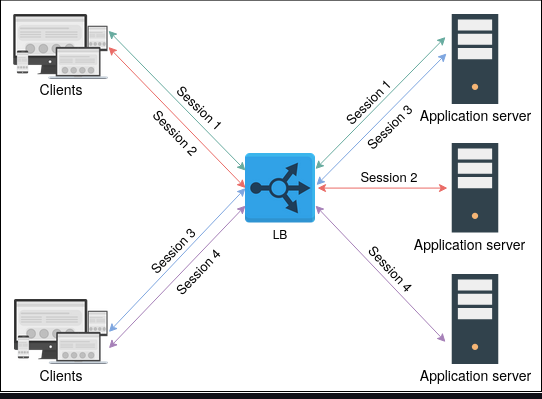
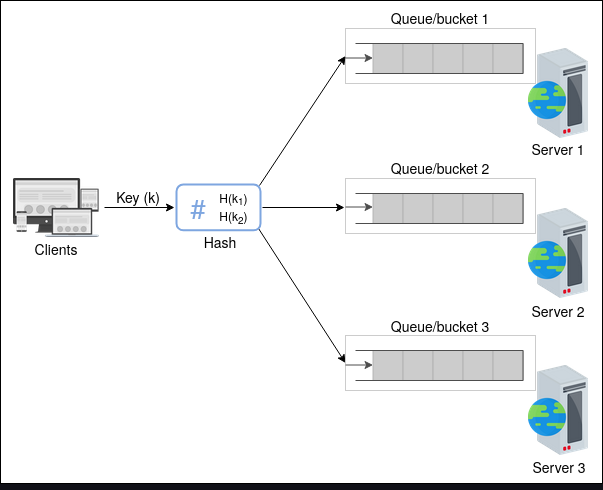

# Stateful versus stateless LBs

- While static and dynamic algorithms are required to consider the health of the hosting servers, a state is maintained to hold session information of different clients with hosting servers.

- If the session information isn’t kept at a lower layer (distributed cache or database), load balancers are used to keep the session information. Below, we describe two ways of handling session maintenance through LBs:
  - Stateful
  - Stateless

## Stateful load balancing

As the name indicates, stateful load balancing involves maintaining a state of the sessions established between clients and hosting servers. The stateful LB incorporates state information in its algorithm to perform load balancing.

Essentially, the stateful LBs retain a data structure that maps incoming clients to hosting servers. Stateful LBs increase complexity and limit scalability because session information of all the clients is maintained across all the load balancers. That is, load balancers share their state information with each other to make forwarding decisions.

### Stateless load balancing

- Stateless load balancing maintains no state and is, therefore, faster and lightweight. Stateless LBs use consistent hashing to make forwarding decisions. However, if infrastructure changes (for example, a new application server joining), stateless LBs may not be as resilient as stateful LBs because consistent hashing alone isn’t enough to route a request to the correct application server. Therefore, a local state may still be required along with consistent hashing.

Therefore, a state maintained across different load balancers is considered as stateful load balancing. Whereas, a state maintained within a load balancer for internal use is assumed as stateless load balancing.
