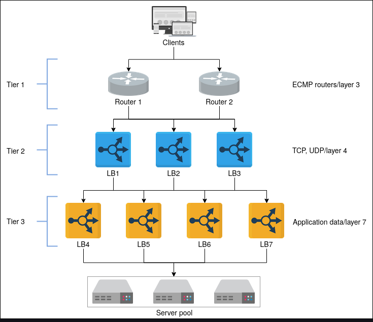
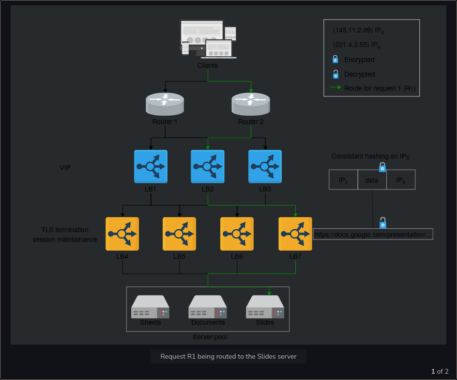
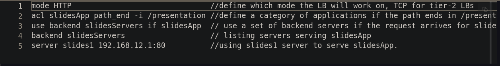
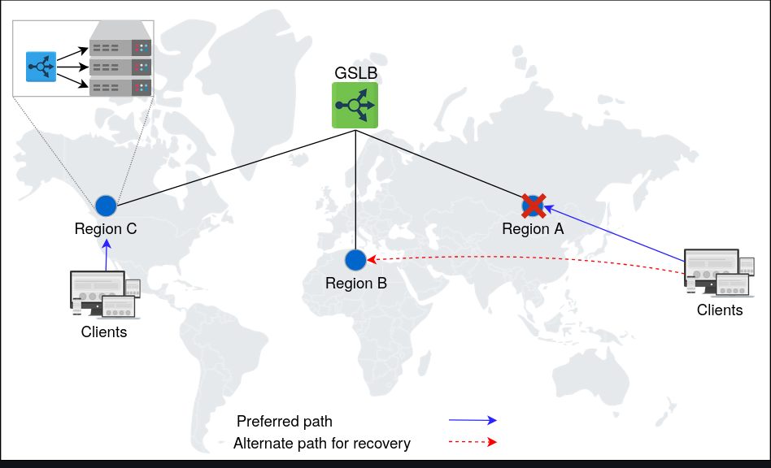

# Load balancer deployment

- We discussed the trade-offs of load balancing performed at different OSI layers. In practice, however, a single layer LB isn’t enough for a large data center. In fact, multiple layers of load balancers coordinate to take informed forwarding decisions. A traditional data center may have a three-tier LB as shown below:

## Tier-0 and tier-1 LBs

- If DNS can be considered as the tier-0 load balancer, equal cost multipath (ECMP) routers are the tier-1 LBs. From the name of ECMP, it’s evident that this layer divides incoming traffic on the basis of IP or some other algorithm like round-robin or weighted round-robin. Tier-1 LBs will balance the load across different paths to higher tiers of load balancers.

- ECMP routers play a vital role in the horizontal scalability of the higher-tier LBs.

## Tier-2 LBs

- The second tier of LBs include layer 4 load balancers. Tier-2 LBs make sure that for any connection, all incoming packets are forwarded to the same tier-3 LBs. To achieve this goal, a technique like consistent hashing can be utilized. But in case of any changes to the infrastructure, consistent hashing may not be enough. Therefore, we have to maintain a local or global state as we’ll see in the coming sections of the lesson.

- Tier-2 load balancers can be considered the glue between tier-1 and tier-3 LBs. Excluding tier-2 LBs could result in erroneous forwarding decisions in case of failures or dynamic scaling of LBs.

## Tier-3 LBs

- Layer 7 LBs provide services at tier 3. Since these LBs are in direct contact with the back-end servers, they perform health monitoring of servers at HTTP level. This tier enables scalability by evenly distributing requests among the set of healthy back-end servers and provides high availability by monitoring the health of servers directly. This tier also reduces the burden on end-servers by handling low-level details like TCP-congestion control protocols, the discovery of Path MTU (maximum transmission unit), the difference in application protocol between client and back-end servers, and so on. The idea is to leave the computation and data serving to the application servers and effectively utilize load balancing commodity machines for trivial tasks. In some cases, layer 7 LBs are at the same level as the service hosts.

- To summarize, tier 1 balances the load among the load balancers themselves. Tier 2 enables a smooth transition from tier 1 to tier 3 in case of failures, whereas tier 3 does the actual load balancing between back-end servers. Each tier performs other tasks to reduce the burden on end-servers.

- Practical example

Let’s look at an example where requests from a client come in and get forwarded to different application servers based on the application data inside the client’s network packets.

- Let’s look at the illustration above in the following steps:
  - $R_1$ indicates request 1 coming through one of the ECMP routers (tier-1 LBs).
  - ECMP routers forward $R_1$ to any of the three available tier-2 LBs using a round-robin algorithm. Tier-2 LBs take a hash of the source IP address ($IP_c$) and forward the packet to the next tier of LBs.
  - Tier-3, upon receiving the packet, offloads TLS and reads the HTTP(S) data. By observing the requested URL, it forwards the request to the server handling requests for slides.

$R_2$ takes the same path but a different end-server because the requested URL contains document instead of slides. Tier-3 LBs are preconfigured to forward requests to application servers based on the application data. For instance, a typical HAProxy server can have the following configuration in tier-3 LBs:

## Implementation of load balancers

Different kinds of load balancers can be implemented depending on the number of incoming requests, organization, and application-specific requirements:

### Hardware load balancers

- Load balancers were introduced in the 1990s as hardware devices. Hardware load balancers work as stand-alone devices and are quite expensive. Nonetheless, they have their performance benefits and are able to handle a lot of concurrent users. Configuration of hardware-based solutions is problematic because it requires additional human resources. Therefore, they aren’t the go-to solutions even for large enterprises that can afford them. Availability can be an issue with hardware load balancers because additional hardware will be required to failover to in case of failures. Finally, hardware LBs can have higher maintenance/operational costs and compatibility issues making them less flexible. Not to mention that hardware LBs have vendor locks as well.

### Software load balancers

- Software load balancers are becoming increasingly popular because of their flexibility, programmability, and cost-effectiveness. That’s all possible because they’re implemented on commodity hardware. Software LBs scale well as requirements grow. Availability won’t be an issue with software LBs because small additional costs are required to implement shadow load balancers on commodity hardware. Additionally, software LBs can provide predictive analysis that can help prepare for future traffic patterns.

### Cloud load balancers

- With the advent of the field of cloud computing, Load Balancers as a Service (LBaaS) has been introduced. This is where cloud owners provide load balancing services. Users pay according to their usage or the service-level agreement (SLA) with the cloud provider. Cloud-based LBs may not necessarily replace a local on-premise load balancing facility, but they can perform global traffic management between different zones. Primary advantages of such load balancers include ease of use, management, metered cost, flexibility in terms of usage, auditing, and monitoring services to improve business decisions. An example of how cloud-based LBs can provide GSLB is given below:

> [Note]
> Another interesting implementation of load balancers comes in the form of client-side load balancing. Client-side load balancing is suited where there are numerous services, each with many instances (such as load balancing in Twitter). Our focus, however, is on traditional load balancers because most three-tier applications employ these in their design.

## Conclusion

LBs have come a long way to become a service offered in the cloud, starting since their inception in the form of hardware. They’re a key component of any enterprise-level service. Horizontal scalability of hosting servers will always require a good load balancing layer capable of providing load balancing, session maintenance, TLS offloading, service discovery, and more.
